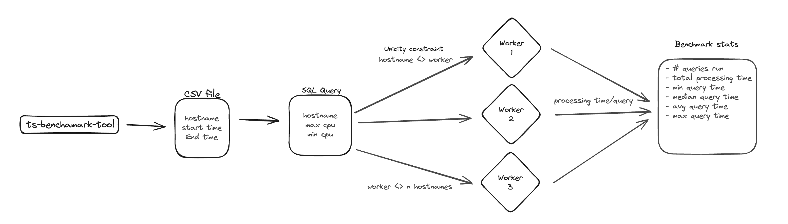

# Timescale Benchmarking Tool

We will try to build a tool to benchmark SELECT queries performance across multiple workers against a TimescaleDB instance.

## Specification

### Inputs

- CSV file or standard input
- Flag: Number of concurrent workers

### Requirments

- Tool should gracefully handle files larger than given example
- Tool shouldn't wait for all inputs to be consumed to start processing query

### Outputs

- /# of queries processed
- total processing time across all queries
- the minimum query time (for a single query)
- the median query time
- the average query time
- the maximum query time

## Implementation

### Process Flow

According to our understanding of the specification and requirment for the Timescale Benchmark tool. We suggest the following process flow:

